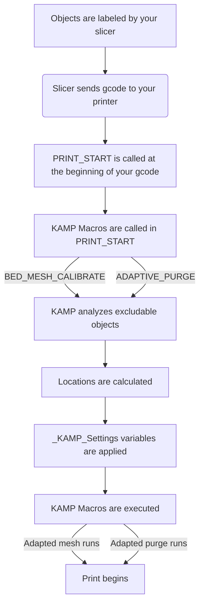

## Something to be aware of for those using Moonraker's Update Manager to use KAMP (Recommended Method):

- If you do not want Moonraker to flag the repo as `dirty`, you must not modify any files inside of the KAMP folder. This is why we have the `_KAMP_Settings` configuration macro.

## For those curious, this is how KAMP works:

1. The user defines their settings for KAMP in the _KAMP_Settings Macro.
2. Whenever `BED_MESH_CALIBRATE` or a `Purge` is called, that macro will: 

   1. Grab variable values you configured in `_KAMP_Settings`.
   2. Combine that information with `exclude_object` information .
   3. Calculate *where* everything needs to happen.
   4. Apply them to the macro you are running. 

Pretty smart, right?

We figured the easiest approach for anyone wanting to use KAMP was to make it as simple as possible. :smile: