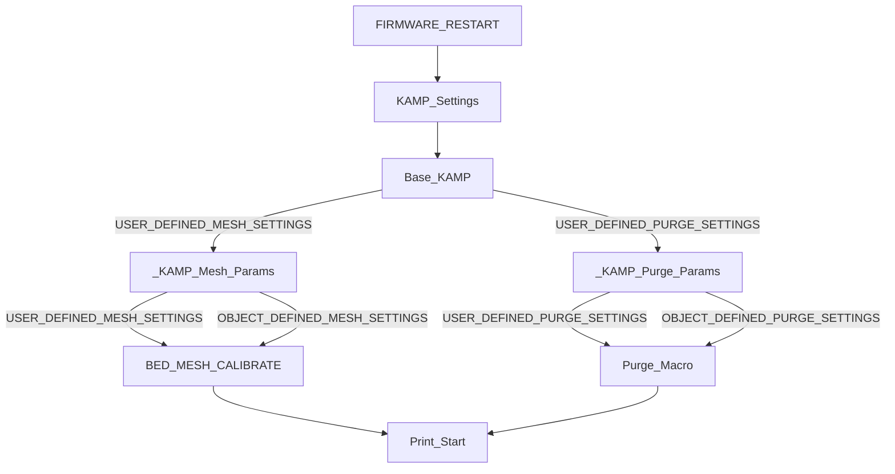

## Something to be aware of for those using Moonraker's Update Manager to use KAMP (Recommended Method):

- If you do not want Moonraker to flag the repo as `dirty`, you must not modify any files inside of the KAMP folder. This is why we have the `KAMP_Settings` configuration macro.

## For those curious, this is how KAMP configuration works:

1. The user defines their settings for KAMP in the KAMP_Settings Macro.
2. KAMP will load these settings 1 second after any `FIRMWARE_RESTART`.
3. Whenever `BED_MESH_CALIBRATE` or a `Purge` is called, that macro will grab variables you defined in `KAMP_Settings` and start running those variables through other macros that will calculate everything KAMP needs to work, and apply them to the macro you are calling. Pretty smart, right?

We figured the easiest approach for anyone wanting to use KAMP was to make it as simple as possible. :smile:

