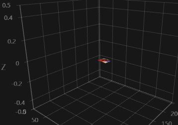
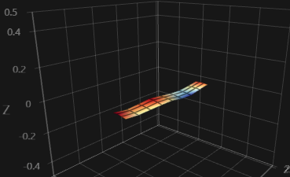
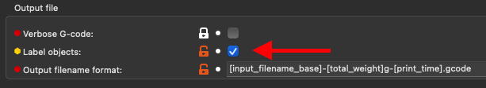
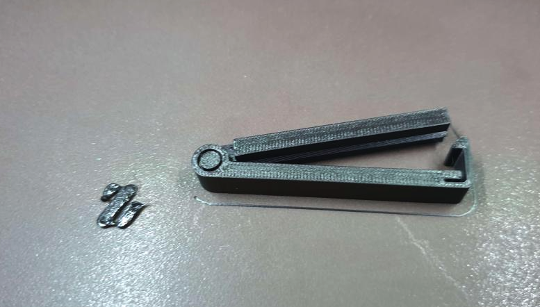

# Klipper Adaptive Meshing and Purging
#### A unique leveling solution for Klipper-enabled 3D printers!
---
### What is it?
KAMP is a project that was created to simplify the usage of adaptive meshing on Klipper-based 3D printers. Adaptive meshing is the practice of parsing values from a gcode file to define a mesh's dimensions. This gives you the benefits of using a bed mesh, but only *specifically* where it is needed!
### How does it work?
Thanks to the great work from [kageurufu](https://github.com/kageurufu) on [Exclude_Object] in the Klipper firmware, we are able to easily work out a bed mesh's `min` and `max` values by pulling out a sliced objects size and clamp that size to a bed mesh. Imagine making a bed mesh, but the size of a Benchy! Multiple objects in gcode are parsed the same way, so the mesh density can adapt to any number of objects, as long as they fit on your buildplate. We can also use these values for localized [purge lines](), purging near the print. No more long romantic walks from the corner of the buildplate to the first extruded line.

### Sounds interesting, what does an adaptive mesh look like?

This is an adaptive mesh for a small object labeled in the gcode around the center of the bed.

This is an adaptive mesh of a skinny and long object labeled in the gcode.

### Does this work with any printer with a probe?
For the most part, yes. Even dockable probes like the popular [Klicky Probe](https://github.com/jlas1/Klicky-Probe)! But, full-disclosure, there is not currently an elegant solution for properly using a [Relative Reference Index](https://www.klipper3d.org/Bed_Mesh.html?h=relative#the-relative-reference-index), though we seem to have been able to get it close enough for now. Got a solution that works great? Submit a pull request! 

**Use caution with inductive probes and beds with powerful magnets, though.**

# Looks awesome! How do I get started?
---
### Prerequisites:
- You must have a version of the Klipper firmware that supports [Object Exclusion](https://www.klipper3d.org/Exclude_Object.html?h=exclude#exclude-objects), and have `[exclude_object]` defined in your `printer.cfg` file. [^1]

- Once you have `exclude_object` defined in your `printer.cfg` file, make sure you have `enable_object_processing: True` under `[file_manager]` in your `moonraker.conf` file. This will allow Klipper to process incoming gcode files for objects. [^1]

- You must have object labeling enabled in your slicer. (Usually in slicer output options.) 

- If you are using a `BED_MESH_CALIBRATE` macro override, you must `#comment` it out or ~~remove it.~~ Don't worry, we thought ahead and made it easy to define macros that attach and remove a probe, like for Klicky, Euclid, and other **dockable** probes.

### Installation:
1. Copy the configuration files to your klipper instance and use [include] to add them to your printer's configuration.
2. Check the macro variables at the top of each configuration file and adjust them accordingly for enabling status lights, dockable probe commands, or even mesh point fuzzing! [^2]
3. Double check your `PRINT_START` macro to ensure `BED_MESH_CALIBRATE` and/or `ADAPTIVE_PURGE` macros are defined.
4. Enjoy!

### Helpful tips & information:
- For richer meshes when printing more/larger objects, increase `probe_count` in your `[bed_mesh]` configuration. We recommend at least `5,5` for a 25-point mesh, but because KAMP can adapt (and rich meshes are beneficial), a 49-point mesh maximum is encouraged, or `7,7`.
- Try out the `ADAPTIVE_PURGE` macro and sign your work with a neat VoronDesign logo purge right before your print begins! There's lots of neat variables that can be configured to get it perfect, every time. 
- If you absolutely must have a perfect implementation of [Relative Reference Index](https://www.klipper3d.org/Bed_Mesh.html?h=relative#the-relative-reference-index), a workaround can be used by combining KAMP with [Automatic Z Calibration](https://github.com/protoloft/klipper_z_calibration).

# Honorable Mentions and Amazing Contributors:
- [MapleLeafMakers](https://github.com/MapleLeafMakers) - for assisting in the inception of the project.
- [Julian Schill](https://github.com/julianschill) - A true code warrior and jinja ninja.
- [KageUrufu](https://github.com/kageurufu) - For spearheading object cancellation in Klipper, and helping make this possible.
- The Voron Helpers and Voron Contributors team, a group I feel are my close friends.

[^1]: After making any changes to critical Klipper or Moonraker functions, be sure to use `FIRMWARE_RESTART`, as well as restart your Moonraker instance so those changes take effect.
[^2]: Mesh point fuzzing allows the user to fuzz mesh points to spread out possible polishing marks and wear from nozzle-based probes, like load cells or Voron Tap.
