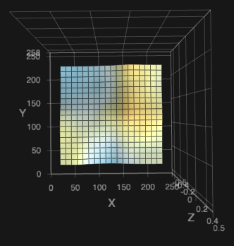
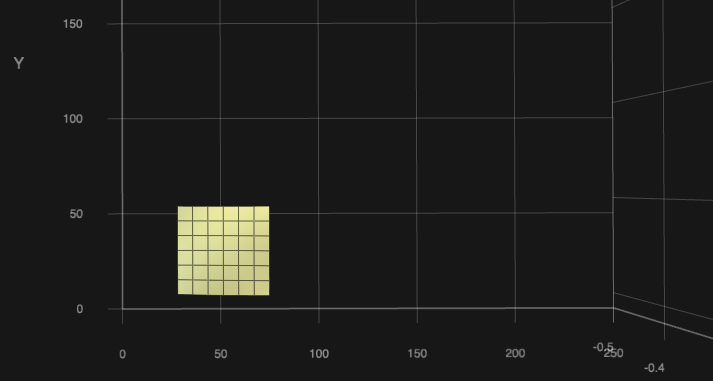

# Klipper Adaptive Meshing and Purging
#### A uniquely simple adaptive meshing solution for Klipper-enabled 3D printers!
---
### What is it?
``KAMP`` is a project that was created to simplify the usage of adaptive meshing on Klipper-based 3D printers. Adaptive meshing is the practice of parsing values from a gcode file to define a mesh's dimensions. This gives you the benefits of using a bed mesh, but only *specifically* where it is needed, without passing a bunch of variables around. ``KAMP`` was designed with simplicity in mind!
### Why do I want this?
The use of bed meshes is considered [cheap insurance](https://github.com/AndrewEllis93/Print-Tuning-Guide/blob/main/articles/troubleshooting/first_layer_squish_consistency.md#first-layer-consistency) by the great [Andrew Ellis](https://github.com/AndrewEllis93) in his very popular [Print Tuning Guide](https://github.com/AndrewEllis93/Print-Tuning-Guide). While I completely agree, I also believe in efficiency. Building a bed mesh can take a bit of time, and what's worse, a lot of it will be wasted because the mesh is not the same size as the build area being **used**, until now! Adaptive meshing will not only waste much less time and effort building bed meshes, it will make your meshes more **effective** by building a richer bed mesh tailored to the area you are *actually* using when you print. Imagine the *perfection* your first layer can become because almost no information is wasted in your bed mesh!
### How does it work?
Thanks to the great work from [kageurufu](https://github.com/kageurufu) on `[exclude_object]` in the Klipper firmware, we are able to easily work out a bed mesh's `min` and `max` values by pulling out a sliced object's size and clamp that size to a bed mesh. Imagine making a bed mesh, but the size of a Benchy! Multiple objects in gcode are parsed the same way, so the mesh density can adapt to any number of objects, as long as they fit on your buildplate. We can also use these values for localized [purge lines](./Configuration/Adaptive_Purge.cfg), purging near the print. No more long romantic walks from the corner of the buildplate to the first extruded line.

### Sounds interesting, what does an adaptive mesh look like?
#### Well, for clarity, let's look at a normal 7x7 mesh:
- 
- This is a normal 7x7 mesh. If I were printing just a couple small objects, or one large object, or a plate full of parts, this is what a machine will normally make.
#### Now, here's what an adaptive mesh looks like:
- 
- This is an adaptive mesh for a small object near the origin of the bed. Despite the fact that the object is only 20mm^2^, a 3x3 mesh was still created, making this mesh **extremely** dense, which will result in an even better first layer.
- 
- This is an adaptive mesh for a skinny and long object at the back of the bed, 200mm x 10mm in size. While the object is rather small, ``KAMP`` made a mesh that is 7x4, almost *exactly* the size of the object, and **packed** with information.
### Does this work with any printer with a probe?
As long as the printer is running a recent version of Klipper, and has a probe, ``KAMP`` is ready to serve you.

Use caution with inductive probes and beds with powerful magnets, though.

#### ⚠️ A note on the usage of a [Relative Reference Index](https://www.klipper3d.org/Bed_Mesh.html?h=relative#the-relative-reference-index):
Relative Reference Index is a method used in the Klipper firmware to calculate mesh points for printers that have a probe, as well as a physical Z endstop, like the ones commonly found on Voron printers. Normally, when using Relative Reference Index, the mesh point closest to the Z endstop or the center of the bed is defined, and that point becomes `Z0.0` in the mesh, and all other points are scaled in Z from that point. This is normally fine when the mesh can't move around, as that point will remain consistent. We've gotten ``KAMP`` to change that value depending on the size of the mesh that is adaptively generated, but current Klipper limitations do not allow us to use that value and home the Z axis to it, setting that point in the mesh to `Z0.0`. What this means for Relative Reference Index users, typically, is your mesh may *appear* strange, but should work as intended. If you've got a creative solution that works, feel free to submit a Pull Request and contribute to the project!
- If you absolutely must have a perfect implementation of [Relative Reference Index](https://www.klipper3d.org/Bed_Mesh.html?h=relative#the-relative-reference-index), a workaround can be used by combining `KAMP` with [Automatic Z Calibration](https://github.com/protoloft/klipper_z_calibration). Alternatively, you can [home the Z axis with your probe](https://docs.vorondesign.com/community/howto/Takuya/Klicky_Probe_AutoZ_Alternative.html) and remove Relative Reference Index from your config altogether. 

--- 
## Looks awesome! How do I get started?

### Prerequisites:
- You must have a version of the Klipper firmware that supports [Object Exclusion](https://www.klipper3d.org/Exclude_Object.html?h=exclude#exclude-objects), and have `[exclude_object]` defined in your `printer.cfg` file. [^1]
>Printer.cfg
>```jinja
>[exclude_object]
>```

- Once you have `exclude_object` defined in your `printer.cfg` file, make sure you have `enable_object_processing: True` under `[file_manager]` in your `moonraker.conf` file. This will allow Klipper to process incoming gcode files for objects. [^1]
>Moonraker.conf
>```jinja
>[file_manager]
>enable_object_processing: True
>```

- You must have object labeling enabled in your slicer. (Usually in slicer output options.) 


- If you are using a `BED_MESH_CALIBRATE` macro override for probe attachment routines, you must `#comment` it out or ~~remove it.~~ Don't worry, we thought ahead and made it easy to define macros that attach and remove a probe, like for Klicky, Euclid, and other **dockable** probes.
>Adaptive_Mesh.cfg:
>```jinja
>variable_probe_dock_enable: True
>variable_attach_macro: 'Attach_Probe'  # The macro you use to attach the dockable probe.
>variable_detach_macro: 'Dock_Probe'    # The macro you use to dock the dockable probe.
>```

### Installation:
1. Copy the configuration files to your klipper instance and use [include] to add them to your printer's configuration.
>Printer.cfg
>```jinja
>[include Adaptive_Mesh.cfg]
>[include Adaptive_Purge.cfg]
>```

2. Check the macro variables at the top of each configuration file and adjust them accordingly for enabling status lights, dockable probe commands, or even mesh point fuzzing! [^2]
3. Double check your `PRINT_START` macro to ensure `BED_MESH_CALIBRATE` and/or `ADAPTIVE_PURGE` macros are defined.
4. Enjoy!

### Helpful tips & information:
- For richer meshes when printing more/larger objects, increase `probe_count` in your `[bed_mesh]` configuration. We recommend at least `5,5` for a 25-point mesh, but because `KAMP` can adapt (and rich meshes are beneficial), a 49-point mesh maximum is encouraged, or `7,7`.
>Printer.cfg
>```jinja
>[bed_mesh]
>probe_count: 7,7
>```

- Try out the `ADAPTIVE_PURGE` macro and sign your work with a neat VoronDesign logo purge right before your print begins! There's lots of neat variables that can be configured to get it perfect, every time.  

# Honorable Mentions and Amazing Contributors:
- [MapleLeafMakers](https://github.com/MapleLeafMakers) - for assisting in the inception of the project.
- [Julian Schill](https://github.com/julianschill) - A true code warrior and jinja ninja.
- [KageUrufu](https://github.com/kageurufu) - For spearheading object cancellation in Klipper, and helping make this possible.
- The Voron Helpers and Voron Contributors team, a group I feel are my close friends.

[^1]: After making any changes to critical Klipper or Moonraker functions, be sure to use `FIRMWARE_RESTART`, as well as restart your Moonraker instance so those changes take effect.
[^2]: Mesh point fuzzing allows the user to fuzz mesh points to spread out possible polishing marks and wear from nozzle-based probes, like load cells or Voron Tap.