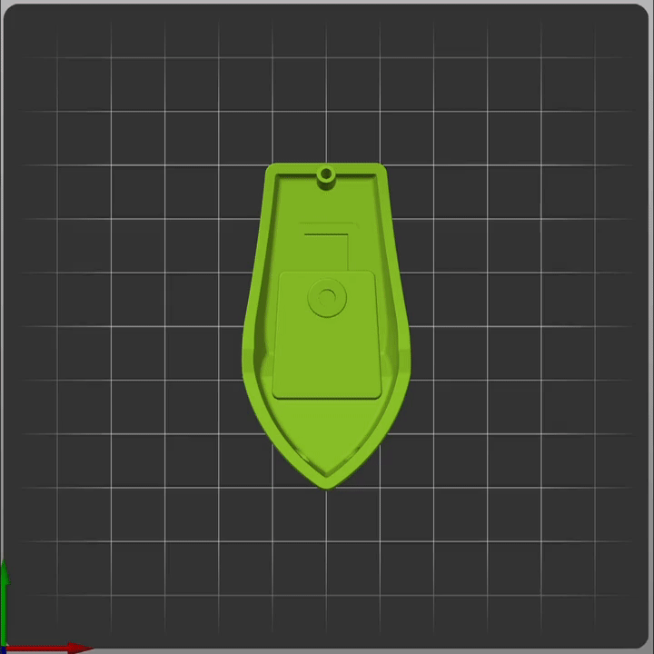

<h1 align="center">
  <br>
  </a>
  <br>
    Klipper Adaptive Meshing & Purging
  <br>
</h1>

<h4 align="center"> Your 3D printer just got a whole lot smarter!</h4>
    <br>
<p align="center">

</p>

<p align="center">
  <a href="#key-features">Key Features</a> •
  <a href="#requirements">Requirements</a> •
  <a href="#installation">Installation</a> •
  <a href="#adaptive-meshing">Adaptive Meshing</a> •
  <a href="#adaptive-purging">Adaptive Purging</a> •
  <a href="#troubleshooting">Troubleshooting</a> •
  <a href="#credits">Credits</a>
</p>

<p align="center">


## Key Features:

* No wasted probe information
  - KAMP will generate a mesh **only** in the area you actually need it: Where you're printing!
  - Since the mesh area will be smaller, the mesh can be much more dense. Imagine making a 3x3 mesh, but the size of a [3DBenchy](https://www.3dbenchy.com)!

* Compatibility
  - If you've got a 3D printer running Klipper and a probe, KAMP is ready to serve you.
  - We've seen users have success with inductive probes, [Klicky](https://github.com/jlas1/Klicky-Probe), [Euclid](https://github.com/nionio6915/Euclid_Probe), BLTouch, and [Voron Tap](https://github.com/VoronDesign/Voron-Tap)
  
    >**Note:**
    >KAMP  has the option to fuzz mesh points, which helps to spread out wear from nozzle-based probing.
* Straightforward setup
  - One of the main goals of KAMP was to be as easy to implement as possible. Just `[include]` a few files, and you're ready to go!


* No parameter passing
  - KAMP uses information from [[exclude_object]](https://www.klipper3d.org/Exclude_Object.html#exclude-objects) to define mesh bounds. Complicated slicer parameter passing is finally a thing of the past. Welcome to the future!

* [Adaptive Purging](#adaptive-purging) 
  - Allows you to purge right next to the print area. We don't believe in boring purges, we like to sign our work with purge logos! We also have provisions for [more simplistic]() purges as well.

<p align="center">

</p>

<p align="center">
    <b>
        Adaptive Voron Logo Purge
    </b>
</p>

## Requirements:

1. You will need `[exclude_object]` defined in `printer.cfg`.

2. You will also need to make sure the following is defined in `moonraker.conf`:
  
    ```yaml
    [file_manager]
    enable_object_processing: True

    ```
3. Finally, you will need to make sure your slicer is labeling objects:

<p align="center">

</p>

<p align="center">
If you've got all that, you're ready for KAMP!
</p>

## Installation:

The cleanest and easiest way to get started with KAMP is to use Moonraker's Update Manager utility. This will allow you to easily install and helps to provide future updates when more features are rolled out!

1. `ssh` into your Klipper device and execute the following commands:
   ```bash
    cd
    
    git clone https://github.com/kyleisah/Klipper-Adaptive-Meshing-Purging.git
    
    ln -s ~/Klipper-Adaptive-Meshing-Purging/Configuration printer_data/config/KAMP

    cp ~/Klipper-Adaptive-Meshing-Purging/Configuration/KAMP_Settings.cfg ~/printer_data/config/KAMP_Settings.cfg
    ```
    > **Note:**
    > This will change to the home directory, clone the KAMP repo, create a symbolic link of the repo to your printer's config folder, and create a copy of `KAMP_Settings.cfg` in your config directory, ready to edit.
    > 
    > It is also possible that with older setups of klipper or moonraker that your config path will be different. Be sure to use the correct config path for your machine when making the symbolic link, and when copying `KAMP_Settings.cfg` to your config directory.

2. Open your `moonraker.conf` file and add this configuration:
   ```yaml
    [update_manager Klipper-Adaptive-Meshing-Purging]
    type: git_repo
    channel: dev
    path: ~/Klipper-Adaptive-Meshing-Purging
    origin: https://github.com/kyleisah/Klipper-Adaptive-Meshing-Purging.git
    managed_services: klipper
    primary_branch: main
    ```

    > **Note:**
    > Whenever Moonraker configurations are changed, it must be restarted for changes to take effect. If you do not want moonraker to notify you of future updates to KAMP, feel free to skip this.

3. Depending on what features you want from KAMP, you'll need to `[include]` some files in your config:

    ```yaml
    # This file contains all settings for KAMP, and must be included in printer.cfg with:

    [include KAMP_Settings.cfg]

    ### The following [includes] can be uncommented from within KAMP_Settings.cfg. ###

    # This file enables the use of adaptive meshing.

    [include ./KAMP/Adaptive_Meshing.cfg]

    # This file enables the use of adaptive line purging.

    [include ./KAMP/Line_Purge.cfg]

    # This file enables the use of the adaptive Voron logo purge.

    [include ./KAMP/Voron_Purge.cfg]

    # This file enables the use of KAMP's Smart Park feature.

    [include ./KAMP/Smart_Park.cfg]
    ```

    >**Note:**
    The KAMP configuration files are broken up like this to allow those who do not use bed probes to benefit from adaptive purging, and other features.

4. After you `[include]` the features you want, be sure to restart your firmware so those inclusions take effect.

<br>

---

<br>

## How to use `KAMP_Settings.cfg`:
<br>

  >**Note:**
  For ease of use and understanding, all KAMP configuration is contained inside of `KAMP_Settings.cfg`. Any changes you wish to make to KAMP specifically can be found here.

<br>

## Adaptive Meshing:

* Mesh generation and adjustment:

  * These variables affect how KAMP creates meshes:

    * `mesh_margin:` This is the amount of space in millimeters **beyond** your print area to further increase the size of the adapted mesh. Rather than a mesh starting at `X50 Y50`, if `Mesh_Margin` is set to `10`, the mesh will be stretched, and the new mesh bounds will start at `X40 Y40` instead. This can be useful for those who commonly use brims when printing. By default, this value is 0.

    * `fuzz_amount:` This is the **maximum** amount that the mesh bounds can be increased in millimeters *by random*. This setting is really only intended for those who use a nozzle-based probe like a strain gauge or Voron Tap. This will slightly randomize the bounds of the bed mesh which will help to spread out wear on your print surface when printing multiples of the same print job (several plates of similar size). By default, this value is 0. **Maximum** `fuzz_amount` recommended is `3`.

<br>

* Using a probe that is not integrated into the printhead (Klicky, Euclid, etc)
  
  * Usually have special macros that are used to attach and detach the probe specifically for mesh leveling. **Those need to be removed/uncommented from your config or they will cause issues.** We will instead call the docking/undocking macros inside of KAMP.

    * `probe_dock_enable:` By default, this setting is `False`. Set this to `True` if your machine has a probe that needs to be attached with a special macro before probing the bed.

    * `attach_macro:` Define the macro that your machine uses to attach the probe here.

    * `detach_macro:` Define the macro that your machine uses to detach the probe here.

## Adaptive Purging:

* These settings directly affect how KAMP handles it's purge routines and placement:

  * `purge_height:` This is the height above the bed that the nozzle will be when KAMP does it's purge. This should not need much adjustment, unless you are using a nozzle with a large diameter, or purging a very small amount. The default for this value is `0.8`.
  
  * `tip_distance:` This is the distance that the very tip of your loaded filament is away from the opening of your nozzle. It's a good idea to tune this value so your purge is nice and consistent, rather than spotty or blown out at the beginning. It's a good idea to set this value to be a little bit less than the final retract that happens in your `Print_End` macro.

<p align="center">

</p>

  * `purge_margin:` This is the amount of space you wish to have between your purge, and your actual print area. Helpful for those who print using brims or skirts, or have a printhead with ducts that are very close to the bed during the first few layers of a print. By default, this value is `10` as a healthy, but conservative buffer.

  * `purge_amount:` This is the amount in millimeters of filament material you wish to purge prior to a print beginning. Some users prefer only to purge enough to get the nozzle ready, and some users prefer to purge enough to change a filament color before a print. After some testing, the default amount to purge is `30` millimeters of material.

  * `flow_rate:` This is the desired flow rate you wish to purge at. You should set this value to be close to the flow limit of your hotend. Standard flow hotends like MicroSwiss, Dragonfly, or Revo should be around `12` or so, while higher flow hotends, like the Rapido or Dragon, should be set somewhere around `20`.

  >**Note:**
It is required to add `max_extrude_cross_section: 5` to your `[extruder]` config to allow effective purging to be possible. KAMP will warn you if you forget to set this value, and skip the purge so the printer will not be halted. It is also recommended to set up [firmware_retraction](https://www.klipper3d.org/Config_Reference.html?h=retract#firmware_retraction) inside of klipper so KAMP can use the correct retration settings for your machine. If this is not found, KAMP will warn you, and use reasonable direct-drive extruder values to complete the purge.

## Smart Park:

* These settings are used for adjusting KAMP's Smart Park function, which is helpful to move the printhead near the print area to do your final heating.

  * `smart_park_height:` This is the height at which you'd like your printhead to be when calling the `Smart_Park` macro. **Don't forget to add `Smart_Park` near the end of your `Print_Start` macro, *before* the final heating command is called.**

## Troubleshooting:

<details>
    <summary>
        <b>
        No matter what, meshes and purges are not adapting!
        </b>
    </summary>
<p>
</p>
This happens when Moonraker's object processor is putting exclude object definitions in the wrong spot (AFTER Print_Start rather than before). This is usually fixed if you add M117 before your print_start macro in your slicer's starting gcode. M117 is just a basic "clear display" gcode, but will force the preprocessor to place the definition macros in the correct spot.
</details>

<details>
    <summary>
        <b>
        I'm getting 'gcode_macro BED_MESH_CALIBRATE:gcode': TypeError: bad operand type for abs(): 'Undefined'
        </b>
    </summary>
<p>
</p>
This was likely caused by you commenting out a setting in KAMP_Settings.cfg rather than just setting it to false. These checks needs to be in place, so instead of commenting them out, just set them to disabled.
</details>

## Credits:

KAMP was not a one man effort, it was made possible with help from fine folks such as:
- [MapleLeafMakers](https://github.com/MapleLeafMakers) - for assisting in the inception of this project.
- [Julian Schill](https://github.com/julianschill) - A true code warrior and jinja ninja.
- [KageUrufu](https://github.com/kageurufu) - For spearheading object cancellation in Klipper, and helping make this possible.
- [Le0n](https://github.com/leanghoun) - For the fantastic KAMP artwork.
- [Yenda](https://github.com/jtrmal) - For bringing KAMP into the realm of Moonraker's Update Manager.

- [You](https://en.wikipedia.org/wiki/You) - For the continued support and sharing KAMP with your friends. :smiling_face_with_three_hearts:

## You may also like...

- [Ellis' Print-Tuning Guide](https://ellis3dp.com/Print-Tuning-Guide/) - A guide for tuning your 3D printer to *perfection*.
- [Jontek2's Print_Start Guide](https://github.com/jontek2/A-better-print_start-macro) - A fantastic `Print_Start` guide for Voron printers.
- [Takuya's Tools](http://tools.takuya.wtf/index.html) A collection of handy tools for any Klipper user.

---


